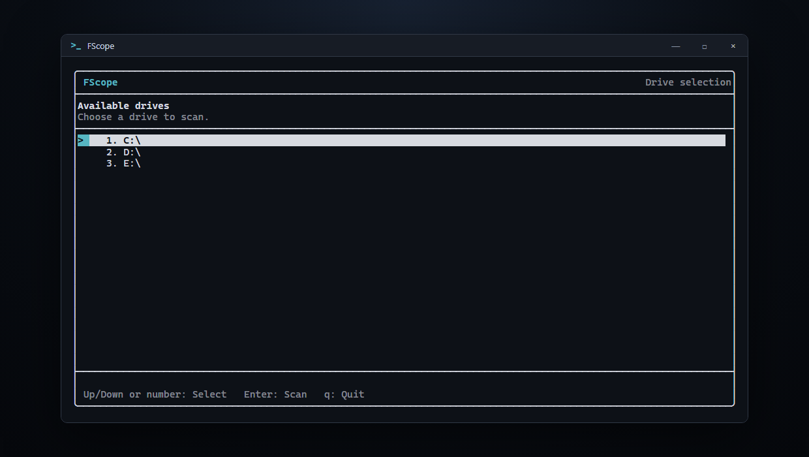
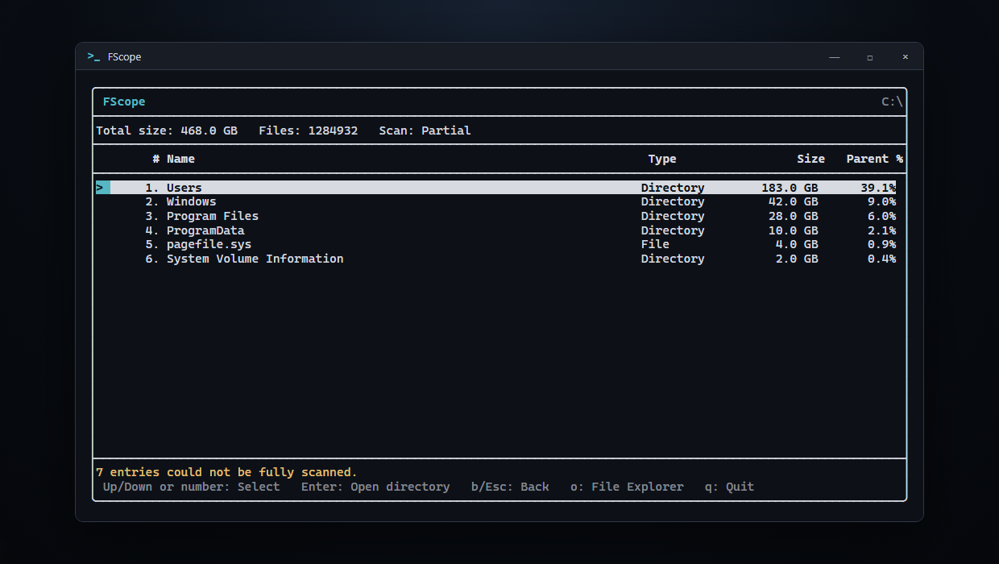

# FScope

FScope is an interactive terminal disk-usage explorer inspired by TreeSize.
It scans Windows drives, sorts their contents by size, and lets you navigate
the resulting file tree without leaving the terminal.

## Install

Download the standalone Windows x64 executable:

[Download fscope.exe](https://github.com/CurtisJ123/FScope2.0/releases/latest/download/fscope.exe)

The executable can be run directly without an installer. Because the current
release is not code-signed, Windows SmartScreen may show a warning for the
downloaded file.

To install the global `fscope` terminal command for the current Windows user,
run this in PowerShell:

```powershell
irm https://raw.githubusercontent.com/CurtisJ123/FScope2.0/main/scripts/install.ps1 | iex
```

Open a new terminal after installation, then run:

```powershell
fscope
```

The installer verifies the release checksum, places `fscope.exe` under
`%LOCALAPPDATA%\Programs\FScope`, and adds that directory to the user `PATH`.
Administrator permissions are not required.

To uninstall:

```powershell
irm https://raw.githubusercontent.com/CurtisJ123/FScope2.0/main/scripts/uninstall.ps1 | iex
```

## Screenshots

### Drive Selection



Select a drive with the arrow keys or its displayed number, then press Enter
to begin scanning.

### Directory Contents



Browse size-sorted scan results with each entry's type, total size, and
percentage of its parent directory.

## Technical Details

FScope enumerates available Windows drives and represents the selected drive
as an in-memory tree of `FileEntry` objects. Its recursive scanner calculates
file and directory totals, tracks file counts, and sorts every directory from
largest to smallest. Symbolic links and junctions are displayed but are not
followed, preventing recursive link loops.

The interface is rendered by FTXUI and uses an event-driven application loop.
Drive scanning runs on a background `std::jthread`, while atomic progress
counters provide live file, directory, byte, and inaccessible-entry totals.
The UI only reads the completed file tree after synchronizing with the scan
worker. Scans that encounter inaccessible entries remain navigable and are
reported as partial rather than discarding the results that were collected.

Controls:

- `Up`/`Down`, `j`/`k`, or a displayed number selects an entry.
- `Enter` scans the selected drive or opens the selected directory.
- `Backspace` edits a typed selection number.
- `b` or `Esc` returns to the parent directory.
- `o` opens the current directory in Windows File Explorer.
- `q` exits FScope and cooperatively cancels an active scan.
- `fscope --version` prints the installed version.
- `fscope --help` prints the command-line help.

Build with Visual Studio 2022 Build Tools and CMake 3.20 or newer:

```powershell
cmake --preset windows-msvc
cmake --build --preset windows-debug
cmake --build --preset windows-release
```

Debug and Release executables are written to `build/Debug/FScope.exe` and
`build/Release/FScope.exe`. CMake downloads the pinned FTXUI dependency
automatically during the first configure.

Pushing a version tag such as `v0.1.0` runs the release workflow. It builds a
statically linked Windows x64 executable and publishes the executable, a ZIP
package, and SHA-256 checksum files to GitHub Releases.

## Tech Used

- C++20
- CMake with `FetchContent`
- FTXUI 7.0.1
- C++ Standard Library filesystem, threading, atomics, and formatting
- Windows API for drive enumeration and File Explorer integration
